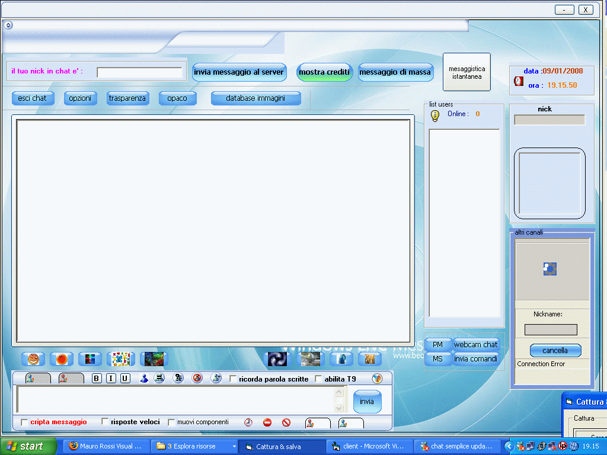



## chat semplice update 3 restyling

### Description

i am italian and i not speak english very well,....this is a smoll chat program , it is for beghinner....this chat is not big but complit...chat , private chat, private message , multi chat rooms , file transfer , smile ( smoll and big ) , transparence with picture effect....nudge, send animation gif, animation flash , database immage , registration client server, instant messenger ( im ) , transparent text with picture effect , try icon , animated try , created your pprofile , interact with over users, link i the richtextbox, list friends , banner user , chat moerator, server full contol the client, a smoll sistem credit , an antispam registration , server bloccked spam attack becouse can block not the chat but the pc of the client.....ecc......

it is idea for beghinner, if you llike my smoll code vote and thenkyou..... encript conversatin with aes 128, block words , autocomplit words ( like T9 cell ), remember words, change color , fonts , change nick , password protect acess program , possibility to recovery password, webcam chat , avatars simple ,animated avatar , custom message box , search users , crypt file , decrypt file, register events , link in the richtextbox , speed reponse , autoanswaring , list banned words , player audio , system create password , popup allert , users profile , possibility to block activity extra chat , verify internet connection , test ports , ecc......

this software is protected by gnu pubblic license, the gnu license the gnu software fundator.....
 
### More Info
 

             |
---                |---
**Submitted On**   |2008-01-09 23:25:32
**By**             |[muteblaster](https://github.com/Planet-Source-Code/PSCIndex/blob/master/ByAuthor/muteblaster.md)
**Level**          |Beginner
**User Rating**    |4.9 (39 globes from 8 users)
**Compatibility**  |VB 6\.0
**Category**       |[Miscellaneous](https://github.com/Planet-Source-Code/PSCIndex/blob/master/ByCategory/miscellaneous__1-1.md)
**World**          |[Visual Basic](https://github.com/Planet-Source-Code/PSCIndex/blob/master/ByWorld/visual-basic.md)
**Archive File**   |[chat\_sempl2096981112008\.zip](https://github.com/Planet-Source-Code/muteblaster-chat-semplice-update-3-restyling__1-69904/archive/master.zip)

